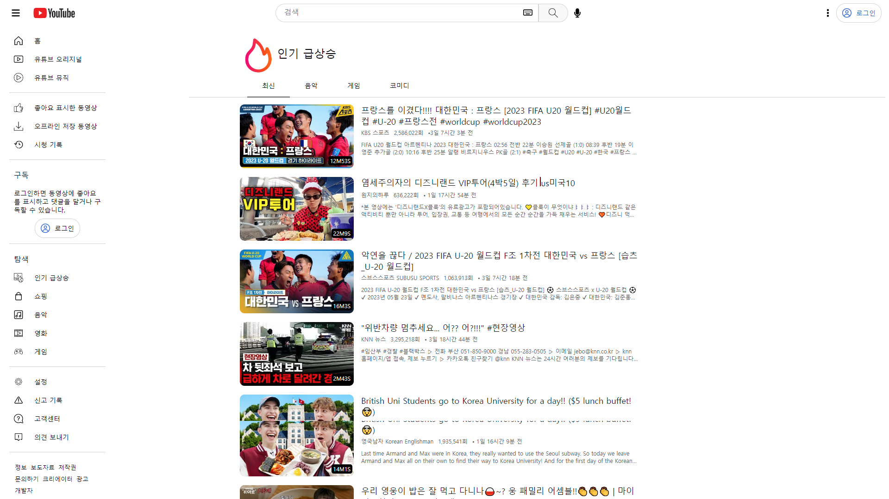

# 프로젝트 이름

   
  유튜브 클론코딩

  
   

## 프로젝트 소개

프로젝트 개요
 
유튜브 API를 사용하여 유튜브 인기급상승동영상 페이지 클론코딩

 

## STACK

Vue
 
Scss
 
Vuex
 
Vue-router
 
Axios
 
dotenv

## 구현 기능

### 기능 1
최신, 음악, 게임, 코미디 카테고리에 따라 50개씩 영상을 제공합니다. 
### 기능 2
각 썸네일에 마우스가 올라갔을 때 iframe을 통해 미리보기 제공하며 사용자 경험을 해치지 않기 위해 영상 재생 시 음소거로 설정했습니다.  
### 기능 3
dotenv를 .env파일에 Apikey를 변수로 설정하여 숨김처리했습니다.
### 기능 4
태블릿화면까지 반응형을 구현했습니다. @mixin과 $로 변수를 선언하여 css를 간결하게 작성했습니다.

 

